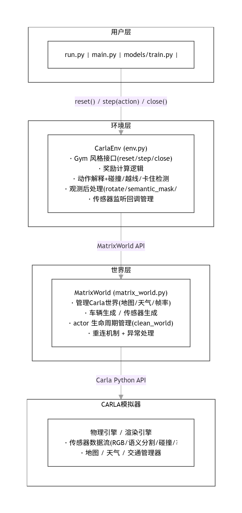
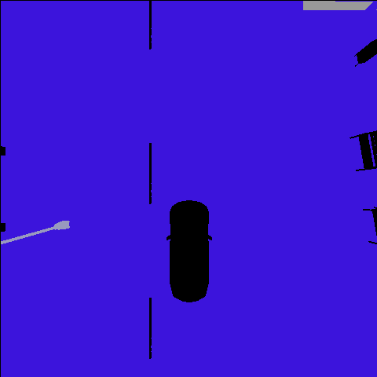
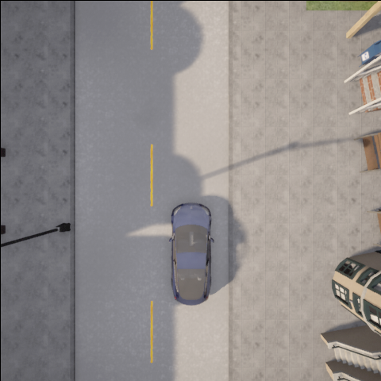

# carla_2d_deeprl

基于 CARLA 模拟器的极简 2D 深度强化学习自动驾驶环境。

---
<table>
  <tr>
    <td><a href="https://www.python.org/"></a></td>
    <td><a href="https://carla.org/"></a></td>
    <td><a href="https://www.gymlibrary.dev/"></a></td>
    </a></td>
  </tr>
</table>


---

## 📑 目录

- [项目简介](#项目简介)
- [核心功能](#核心功能)
- [使用方法](#使用方法)
- [架构总览](#架构总览)
- [观测空间](#观测空间)
- [动作空间](#动作空间)
- [奖励函数](#奖励函数)
- [配置系统](#配置系统)
- [改进对比](#改进对比)
- [依赖](#依赖)
- [参考](#参考)

## 项目简介

carla_2d_deeprl 是一个基于 [CARLA](https://carla.org/) 模拟器实现的轻量级 2D 强化学习自动驾驶环境，提供类 Gym 接口、语义分割俯视图观测和可配置的奖励函数，适合快速验证 DQN 等深度强化学习算法。环境支持基于俯视视角的2D观测（RGB图像或简化语义分割图像），并设计了以车道中心为目标的奖励函数：智能体行驶在车道中心时获得正奖励，偏离车道中心则根据距离获得负奖励。该环境虽未完全兼容OpenAI Gym标准，但遵循Gym式接口设计，可直接用于测试各类基础强化学习算法。


---
## 核心功能
1. **2D观测输入**：支持RGB图像或简化语义分割的俯视视角观测，可自定义观测画面的宽高尺寸。
2. **可配置仿真场景**：支持切换不同天气效果，兼容多种城市场景地图。
3. **训练优化模式**：提供无渲染模式，大幅提升训练效率，减少不必要的性能开销。
4. **调试辅助功能**：内置调试模式，便于快速验证环境逻辑与算法效果。
5. **训练加速特性**：提供Fast Mode，专为强化学习训练优化，减少仿真器冗余计算。

## 使用方法

### 1. 环境搭建

```bash
# 克隆仓库
git clone https://github.com/mt960/nn.git
cd nn/src/carla_2d_deeprl

# 创建虚拟环境
python -m venv venv
# Windows
venv\Scripts\activate
# Linux/Mac
source venv/bin/activate

# 安装依赖
pip install -r requirements.txt
```

### 2. 启动 CARLA

下载 [CARLA 0.9.16](https://github.com/carla-simulator/carla/releases/tag/0.9.16) 并启动：

```bash
# Windows
CarlaUE4.exe

# Linux
./CarlaUE4.sh
```

### 3. 运行演示

```bash
# 快速测试环境（直行 5 个 episode）
python run.py

# 运行预训练模型演示
python main.py demo

# 训练新模型
python main.py train

# 运行自动化测试
python main.py test
```

---

## 架构总览



**三层分离设计**：

| 层级 | 文件 | 职责 |
|:----|:----|:-----|
| **用户层** | `run.py`, `main.py`, `models/` | 调用环境接口，运行算法 |
| **环境层** | `min_carla_env/env.py` | 封装 Gym 接口，计算奖励，处理观测 |
| **世界层** | `min_carla_env/matrix_world.py` | 操作 Carla 模拟器，生成管理 actor |

---

## 观测空间

环境提供 **2D 俯视视角**的观测图像，支持两种模式：

### 语义分割模式（默认，channels=1）



将 CARLA 的 13 类语义标签映射为 6 类简化标签：

| 标签值 | 类别 | CARLA 原始标签映射 |
|:------:|:-----|:------------------|
| 0 | 空 (None) | — |
| 1 | 道路 (Road) | Road(7) |
| 2 | 车道线 (RoadLine) | RoadLine(6) |
| 3 | 路灯 (Pole) | Pole(5) |
| 4 | 其他 (Other) | Building/Fence/Pedestrian/Vegetation/Wall/TrafficSign... |
| 5 | 车辆 (Vehicle) | Vehicle(10) |


### RGB 模式（可选，channels=3）



原始的 CARLA RGB 相机图像。


### 参数配置

```python
OBS_CONFIG = {
    "width": 480,      # 宽度（可动态修改）
    "height": 480,     # 高度（可动态修改）
    "channels": 1,     # 通道数：1=语义分割, 3=RGB
}
```

观测经过 `imutils.rotate_bound` 旋转，使**车辆始终位于画面中央底部**，车头朝上。

---

## 动作空间

3 个离散动作，每个动作映射为 `(throttle, steer)` 元组：

| 动作 ID | 名称 | 含义 |
|:-------:|:-----|:-----|
| **0** | Coast（直行） | `throttle=0.0, steer=0.0` |
| **1** | Turn Left（左转） | `throttle=0.0, steer=-0.5` |
| **2** | Turn Right（右转） | `throttle=0.0, steer=0.5` |

```python
ACTIONS = {
    0: [0.0,  0.0],    # 直行
    1: [0.0, -0.5],    # 左转
    2: [0.0,  0.5],    # 右转
}
```

车辆的实际油门/刹车由环境自动控制，根据当前车速 `kmh` 自动切换：

- `kmh < 20`：`throttle=0.3, brake=0.0`（加速）
- `kmh >= 20`：`throttle=0.0, brake=0.2`（减速）

---

## 奖励函数

奖励函数由 4 部分组成：

### 1. 车道中心奖励（核心）


$$r_{\text{center}} = \begin{cases} +0.5, & d < 0.5 \ \text{(在车道中心)} \\ -\min(1.0 \cdot e^{d}, 1000), & \text{其他 (偏离车道)} \end{cases}$$

其中 $d$ 为车辆当前位置到最近车道中心线的欧几里得距离。

### 2. 速度奖励

$$r_{\text{speed}} = 0.01 \times kmh$$

鼓励车辆保持行驶，避免原地不动。

### 3. 终止事件惩罚

| 终止条件 | 惩罚 |
|:---------|:-----|
| 碰撞 (Collision) | `reward *= 2.0`（奖励放大负值） |
| 压实线 (Solid Lane) | `reward *= 2.0` |
| 上人行道 (Sidewalk) | `reward *= 2.0` |
| 卡住超过 20 步 (Stuck) | `reward -= 100.0` |

### 4. 终止条件

- 超出最大步数（`max_step = 90000`）
- 偏离车道过度（`reward < -dist_penalty_clip`，即 `-1000`）
- 发生碰撞
- 压实线或上人行道
- 卡住超过 20 步

### 完整奖励公式

$$r_t = r_{\text{center}} + r_{\text{speed}} + \text{(penalty multipliers)}$$

---

## DQN 模型架构

模型定义在 `models/dqn.py`，基于 PyTorch，结构为 **Conv3 → Linear**：

```text
Input: (channel, 120, 120)   # channel=1(语义分割) 或 3(RGB)
    │
    ├─ Conv2d(channel→16, kernel=5, stride=2) + BatchNorm2d + ReLU
    │   Output: (16, 58, 58)
    │
    ├─ Conv2d(16→32, kernel=5, stride=2) + BatchNorm2d + ReLU
    │   Output: (32, 27, 27)
    │
    ├─ Conv2d(32→32, kernel=5, stride=2) + BatchNorm2d + ReLU
    │   Output: (32, 12, 12)
    │
    └─ Linear(32×12×12 → 3)   # 3 = 动作数
```

### 训练超参数

| 参数 | 值 |
|:----|:---|
| BATCH_SIZE | 256 |
| GAMMA（折扣因子） | 0.999 |
| EPS_START | 0.9 |
| EPS_END | 0.05 |
| EPS_DECAY | 500 |
| TARGET_UPDATE | 10 episode |
| OPTIM_FREQ | 2 step |
| 优化器 | RMSprop (lr=5e-3) |
| 回放缓冲区 | ReplayMemory (capacity=8192) |

---

## 配置系统

配置分为 4 个独立模块（`config.py`），支持独立修改：

### OBS\_CONFIG — 观测配置

```python
OBS_CONFIG = {
    "width": 480,
    "height": 480,
    "channels": 1,
}
```

### ENV\_CONFIG — 环境参数

```python
ENV_CONFIG = {
    "max_step": 90000,
    "target_speed": 20,
    "throttle": 0.3,
    "stuck_max_count": 20,
}
```

### REWARD\_CONFIG — 奖励系数

```python
REWARD_CONFIG = {
    "lane_center_reward": 0.5,
    "dist_penalty_scale": 1.0,
    "dist_penalty_clip": 1000.0,
    "collision_penalty_mult": 2.0,
    "stuck_penalty": 100.0,
    "speed_reward_scale": 0.01,
}
```

### RENDER\_CONFIG — 渲染/模式开关

```python
RENDER_CONFIG = {
    "render": True,    # 渲染画面
    "fast": False,     # 快速模式
    "debug": False,    # 调试模式
}
```

`CONFIG` 字典为向后兼容的聚合配置：`{**OBS_CONFIG, **ENV_CONFIG, **RENDER_CONFIG}`。

---


---

## 改进对比

与原项目 [mcemilg/min-carla-env](https://github.com/mcemilg/min-carla-env) 相比，本项目做了以下改进：

| 改进项 | 原始 min-carla-env | carla_2d_deeprl                                       |
|:-------|:-------------------|:------------------------------------------------------|
| **配置分离** | CONFIG 写在 env.py 中 | 拆分为 config.py（OBS/ENV/REWARD/RENDER 四部分）              |
| **奖励系数** | 固定系数，不可配置 | 全部可配置，支持 `reward_config` 参数传入                         |
| **异常处理** | 无重连机制 | 5 次 actor 重试 + Carla 客户端重连                            |
| **视角优化** | 初始设定后不跟随 | `update_spectator_follow()` 每步实时俯视跟随                  |
| **连接管理** | 无连接检查 | `reconnect_carla_client()` 重连 + get_server_version 验证 |
| **PEP 8** | 部分文件超 99 字符 | flake8 零报错，max-line-length=99                         |
| **模块主入口** | 无 | main.py                                               |
| **文档** | 仅 README | MkDocs 文档系统                                           |
| **自动化测试** | 无 | pytest 测试套件                                           |

---

## 依赖

```text
gym==0.17.1
numpy~=2.4.4
opencv-python~=4.13.0.92
torch~=2.11.0
torchvision~=0.26.0
pillow~=12.2.0
imutils~=0.5.4
tensorboard~=2.11.0
mkdocs~=1.6.0
```

---
## 参考
源码目录 [src/carla_2d_deeprl](https://github.com/mt960/nn/tree/main/src/carla_2d_deeprl)

参考仓库 [mcemilg/min-carla-env](https://github.com/mcemilg/min-carla-env)
## License

MIT