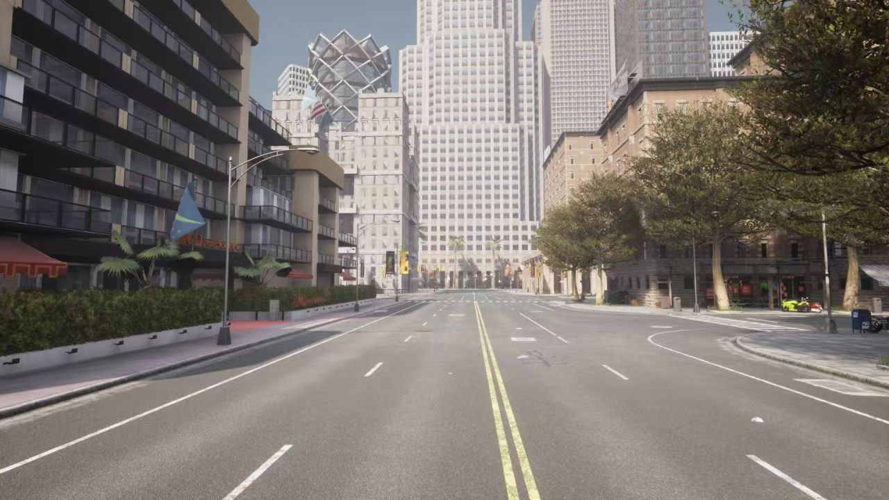
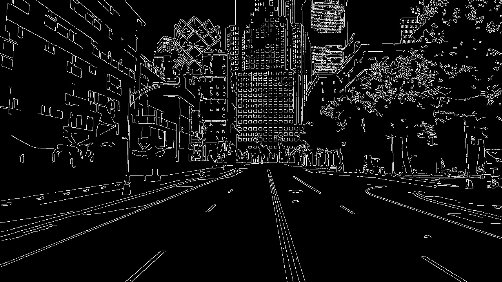
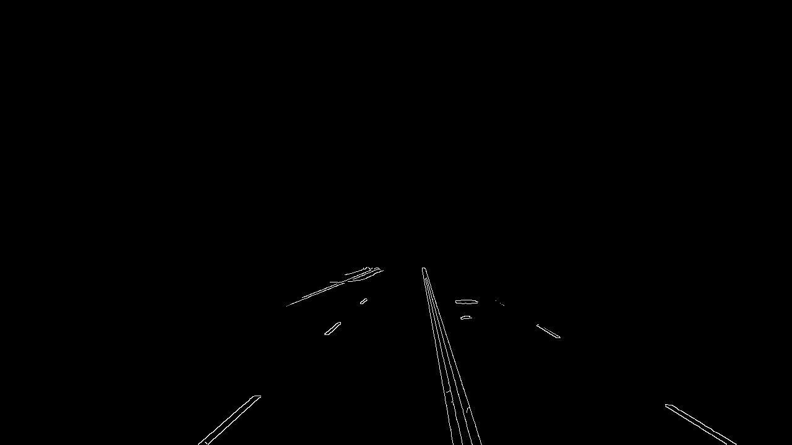
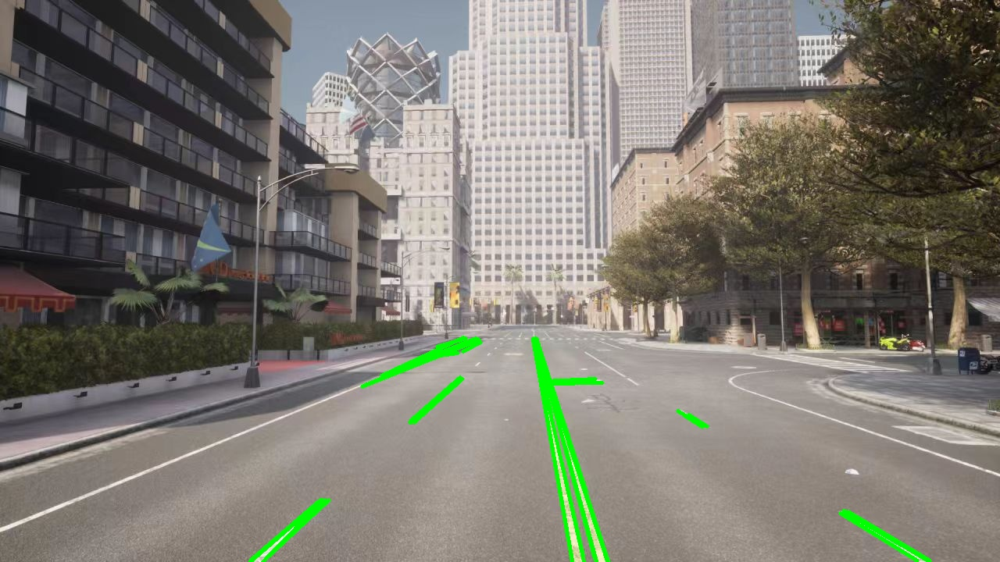
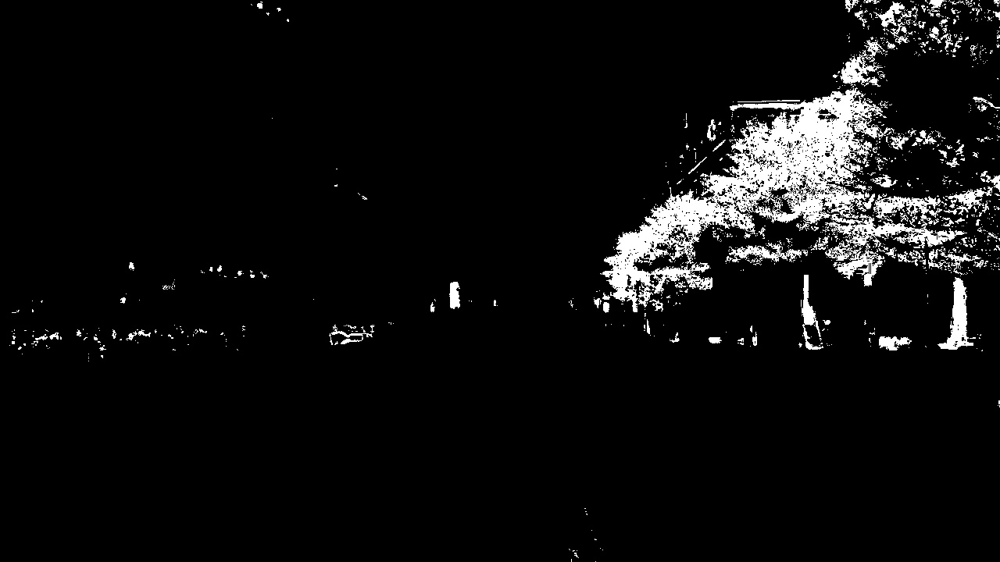
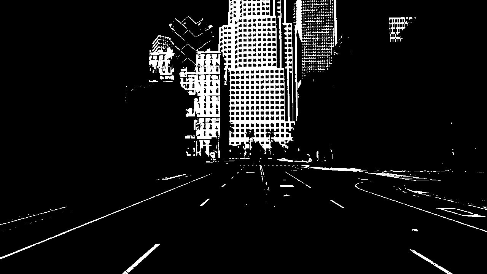
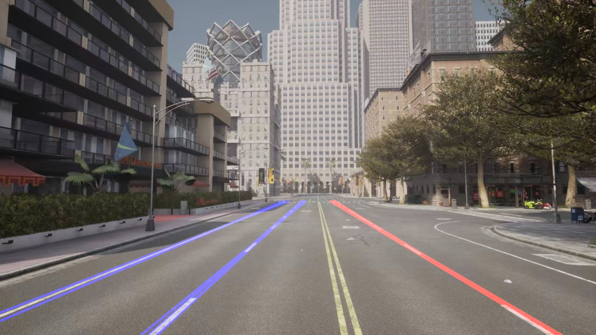

# 车道线检测（lane_detection）

基于 OpenCV 的 Carla 场景车道线检测模块，分步完成预处理、边缘检测、霍夫直线检测与 HSV 多车道拟合。

**作者**：ultra223  
**课题进度**：2/10（步骤1 基础检测 + 步骤2 HSV 优化）

## 模块结构

| 文件 | 说明 |
| :--- | :--- |
| `main.py` | **唯一入口**，运行整个模块 |
| `config.py` | 路径与算法参数 |
| `lane_preprocess.py` | 步骤1：灰度、Canny、ROI、霍夫 |
| `lane_detect.py` | 步骤2：HSV 黄白线、双黄线中心轴、左右车道 |
| `carla_test.jpg` | 少量示例输入（运行依赖） |

## 开发环境

- Python 3.8+
- OpenCV-Python、NumPy

```bash
pip install opencv-python numpy -i https://pypi.tuna.tsinghua.edu.cn/simple
```

## 运行方式

在仓库根目录或模块目录下执行：

```bash
cd src/lane_detection
python main.py
```

```bash
# 步骤2：HSV 多车道检测
python main.py --mode hsv

# 重新生成文档配图（写入 docs/lane_detection/images）
python main.py --save-docs --no-show
python main.py --mode hsv --save-docs --no-show
```

## 步骤1：基础版（Canny + 霍夫）

对 Carla 测试图做灰度化、高斯模糊、Canny 边缘检测、梯形 ROI 裁剪，再用霍夫变换检测车道线段。

**输入原图**



**Canny 边缘**



**ROI 区域**



**霍夫直线叠加结果**



## 步骤2：HSV 预处理优化

在 HSV 空间分别提取黄色（双黄线）与白色（车道线）掩膜，以双黄线为界划分左右车道并拟合绘制。

**输入原图**


**黄色车道线掩膜**



**白色车道线掩膜**



**多车道拟合结果**



## 参考

- [OpenHUTB/nn 贡献指南](https://github.com/OpenHUTB/nn/blob/main/README.md)
- [carla_CAM 模块文档](../carla_CAM/README.md)（文档与 mkdocs 约定示例）
