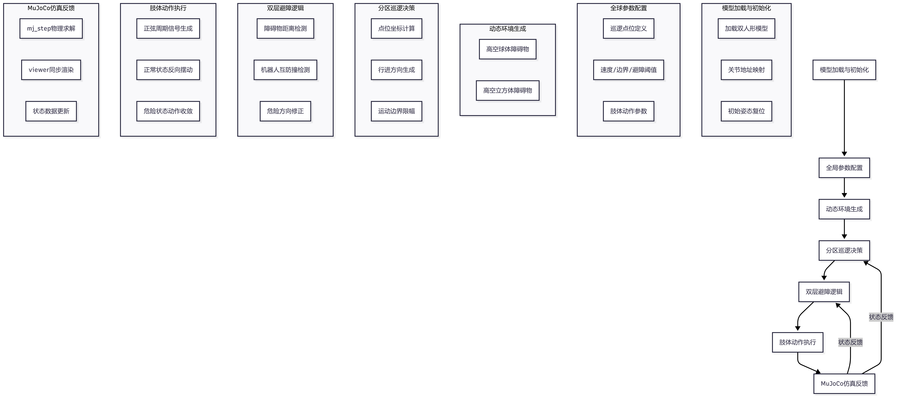
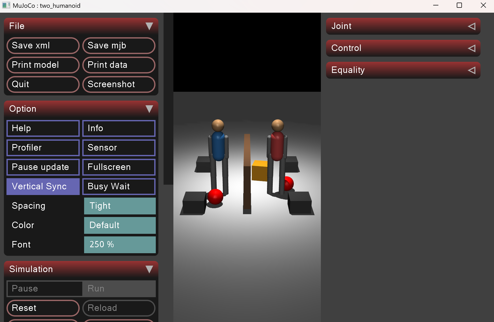
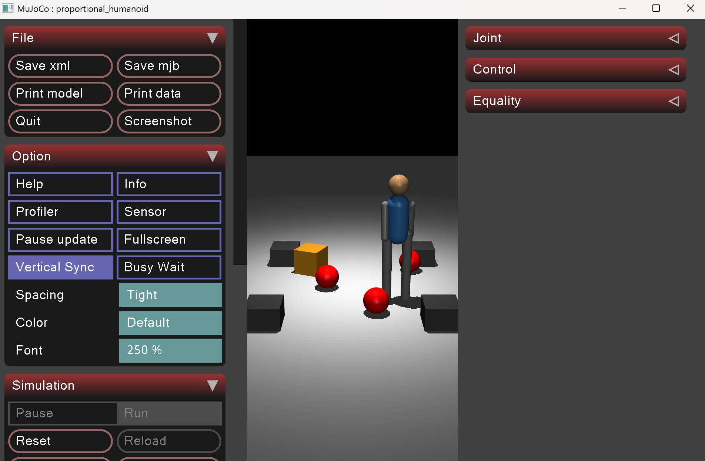

# 双机器人分区巡逻与动态避障仿真系统（MuJoCo）
## 1.项目概述
### 1.1 项目简介
本项目面向双人形机器人协同作业仿真需求，基于 MuJoCo 物理仿真引擎实现**分区自主巡逻、高空动态障碍物规避、机器人相互防撞、周期性肢体摆动**一体化功能。系统采用**点位巡航+距离判定避障+正弦节律肢体动作**轻量化控制架构，无需复杂智能算法即可完成多机器人协同行为演示，具备纯本地运行、逻辑清晰、参数易调、可二次扩展等特点。

项目在**关节地址映射、运动边界限幅、双层避障逻辑、动态障碍物生成、拟人肢体动作**等工程问题上完成落地实现，最终构建一套**可运行、可复现、可拓展路径规划与集群算法**的多机器人仿真基线系统。

### 1.2 项目整体流程
该系统形成完整的机器人行为闭环：
模型加载与初始化 → 巡逻点位与参数配置 → 动态障碍物生成 → 分区行进控制 → 双层避障判定 → 肢体动作输出 → 仿真步进与状态反馈

### 1.3 项目组成
| 模块     | 核心变量/逻辑                                   | 功能                             |
| ------ | ------------------------------------------ | ------------------------------ |
| 模型加载模块 | 模型、数据实例 + 关节 `qposadr` 地址映射 | 加载机器人模型，绑定所有受控关节索引 |
| 参数配置模块 | 运动速度、距离阈值、时间间隔、动作幅度常量 | 统一管理仿真与控制全局参数 |
| 巡逻点位模块 | `patrol1`、`patrol2`、点位索引 `idx1/idx2` | 划分左右区域，定义循环巡航路径 |
| 障碍物模块 | 定时随机生成球体/立方体 | 模拟高空动态干扰障碍物 |
| 巡逻控制模块 | 方向计算、坐标更新、边界限幅 | 控制机器人沿预设点位自主移动 |
| 避障检测模块 | 欧式距离判定逻辑 | 实现障碍物避让、机器人互防撞 |
| 肢体动作模块 | 正弦周期振荡信号 | 生成手臂、髋关节拟人摆动动作 |
| 仿真主循环 | `mj_step` + 可视化同步 | 物理求解、画面渲染与闭环运行 |

本项目的核心价值在于：**搭建轻量化多机器人行为仿真框架，为集群巡逻、避障、路径规划等算法提供测试平台**。

### 1.4 核心技术特点
| 特点       | 说明                                                   |
| :------- | :--------------------------------------------------- |
| **分区协同巡逻** | 双机器人划分独立区域，沿矩形点位循环巡航，区域互不干涉 |
| **双层避障机制** | 同时检测高空障碍物与邻机间距，双重安全防护 |
| **节律肢体运动** | 基于正弦函数生成周期摆动，还原人形行走姿态 |
| **动态环境模拟** | 定时随机生成高空球体、立方体，构建动态干扰场景 |
| **运动边界约束** | 坐标限幅防止机器人越界，提升系统稳定性 |
| **纯轻量化架构** | 无复杂控制算法，逻辑简单、运行高效、调试便捷 |

### 1.5 运行环境与使用方式
#### 环境准备
```bash
pip install mujoco numpy
```

#### 运行演示（推荐入口）
```bash
python main.py
```

#### 文件目录说明
```
./
├── main.py          # 仿真主程序
└── humanoid.xml     # MuJoCo 人形机器人模型文件（同目录放置）
```

### 1.6 项目核心目标
- **可运行性**：Windows / Linux 跨平台直接运行，无需额外依赖。
- **分区巡逻**：两台机器人在各自区域内稳定完成循环点位巡航。
- **双重避障**：实现动态障碍物避让与机器人之间相互防碰撞。
- **拟人动作**：常态下肢体周期性摆动，危险状态下动作自适应收敛。
- **可扩展性**：保留完整框架接口，支持后续接入路径规划、集群控制、传感器仿真等功能。

## 2. 项目背景与问题定义
### 2.1 背景
多移动机器人分区巡逻是集群机器人领域典型应用场景，在安防巡检、区域作业等场景具备实际价值。人形机器人兼具移动底盘与多自由度肢体，除位置移动外，还需要搭配自然肢体动作提升仿真真实性。

MuJoCo 凭借高精度刚体动力学、接触仿真、简洁 Python 接口，成为机器人行为仿真主流平台。传统简易仿真脚本普遍存在**关节索引混乱、机器人越界、相互碰撞、姿态僵硬、动态环境缺失**等问题。本项目基于 MuJoCo 搭建标准化仿真框架，采用**点位巡航+距离避障+关节精准映射**方案，构建稳定可用的多机器人巡逻仿真基线。

### 2.2 现存痛点
- 多机器人联合控制时，关节索引采用固定切片易出现错位；
- 无边界约束，机器人运动范围失控、跑出仿真区域；
- 缺少避障逻辑，机器人易与障碍物、同伴发生碰撞；
- 仅实现点位移动，肢体姿态僵硬，缺乏拟人行走效果；
- 环境静态化，无动态障碍物，仿真场景真实性不足。

基于这些问题，本项目使用 MuJoCo 物理仿真平台，采用**定点巡逻+距离避障+周期肢体动作**组合方案，逐步优化系统稳定性与仿真效果。

### 2.3 项目建设目标
- **分区巡航**：两台人形机器人在左右独立区域完成稳定循环巡逻。
- **动态避障**：对随机出现的高空障碍物进行主动避让。
- **集群防撞**：机器人之间保持安全距离，杜绝相互碰撞。
- **拟人运动**：实现手臂、髋关节周期性摆动，模拟自然行走姿态。
- **工程稳定性**：增加运动限幅、姿态固定、危险动作收敛等机制。
- **功能拓展性**：框架模块化设计，便于后续算法迭代与功能新增。

## 3. 核心技术栈与理论基础
本项目技术栈分为仿真层、控制层、算法层、可视化层四部分。

### 3.1 核心技术栈
| 技术类别   | 具体选型           | 说明               |
| :----- | :------------- | :--------------- |
| 物理仿真引擎 | MuJoCo 2.3+    | 刚体动力学求解、接触计算、状态更新 |
| 数值计算   | NumPy          | 欧式距离、符号判断、数值限幅、三角函数运算 |
| 基础工具库 | Python 3.8+ / random / time / os | 路径读取、随机障碍物生成、计时控制 |
| 开发语言   | Python 3.8+    | 逻辑开发、快速调试、跨平台运行 |
| 机器人模型 | 自定义 XML 人形模型 | 含平移底盘、双臂、双腿多自由度结构 |

上表概括了本项目最核心的开发与运行基础。围绕这些技术，项目进一步形成了 **"模型-控制-仿真"** 三段式工程闭环。

### 3.2 仿真层：MuJoCo
MuJoCo（Multi-Joint Dynamics with Contact）是面向机器人控制的物理仿真引擎，支持：
- 刚体动力学与接触力建模
- 关节姿态、速度实时读写
- Python API 全流程控制
- 内置可视化 Viewer 实时渲染

在本项目中，MuJoCo 主要承担三个作用：
- 加载双人形机器人 XML 模型，解析关节、刚体、几何对象；
- 提供机器人坐标、关节姿态、刚体位置等状态反馈；
- 执行关节位置指令，完成物理步进与画面刷新。

相关代码位置：
- 模型与数据加载：`main()` 函数模型初始化段
- 关节地址绑定：`main()` 内各关节 `qposadr` 获取代码
- 物理步进：`mujoco.mj_step(model, data)`
- 可视化渲染：`viewer.launch_passive` 与 `v.sync()`

### 3.3 控制层：关节映射与运动约束
本项目通过**关节名称寻址**获取 `qpos` 数组偏移地址，彻底避免固定切片带来的索引错位问题。

```python
r1_slide_x = model.joint("r1_slide_x").qposadr.item()
r1_slide_y = model.joint("r1_slide_y").qposadr.item()
r1_arm_l = model.joint("r1_j_larm").qposadr.item()
r1_arm_r = model.joint("r1_j_rarm").qposadr.item()
r1_hip_l = model.joint("r1_left_hip").qposadr.item()
r1_hip_r = model.joint("r1_right_hip").qposadr.item()
r1_knee_l = model.joint("r1_left_knee").qposadr.item()
r1_knee_r = model.joint("r1_right_knee").qposadr.item()
```

同时采用 `np.clip` 对机器人平面坐标做硬约束，限制运动范围：
```python
r1_x = np.clip(r1_x,-MOVE_LIMIT,MOVE_LIMIT)
r1_y = np.clip(r1_y,-MOVE_LIMIT,MOVE_LIMIT)
```

### 3.4 控制算法与运动学基础
本项目采用 **点位巡航+距离避障+正弦周期肢体动作** 分层控制架构，整体分为三层：
**高层路径规划 → 中层避障决策 → 底层关节执行**，形成完整控制闭环。

#### 3.4.1 分区点位巡航逻辑
为两台机器人划分独立矩形巡逻路径，通过点位索引循环切换目标位置：
```python
# R1 左侧巡逻区域点位
patrol1 = [[-0.75, -0.3], [-0.3, -0.3], [-0.3, 0.3], [-0.75, 0.3]]
# R2 右侧巡逻区域点位
patrol2 = [[0.3, -0.3], [0.75, -0.3], [0.75, 0.3], [0.3, 0.3]]
```

控制逻辑：根据当前点位与机器人坐标差值，使用 `np.sign` 获取行进方向，叠加固定步长实现连续移动；到达点位阈值后自动切换下一个巡航点。

#### 3.4.2 欧式距离避障模型
系统两套避障逻辑均基于二维欧式距离判定，距离公式：
$$
d = \sqrt{(x_2-x_1)^2 + (y_2-y_1)^2}
$$

1. **高空障碍物避障**
遍历仿真环境中高空刚体坐标，当障碍物与机器人距离小于检测阈值，立即反向调整行进方向，脱离危险区域。

2. **机器人互避障**
计算两台机器人平面间距，当小于安全距离时，停止原巡逻方向，沿轴向偏移拉开间距，防止碰撞。

#### 3.4.3 正弦节律肢体摆动
采用正弦函数生成连续周期信号，模拟人形机器人行走时手臂、髋关节自然摆动：
$$
s = \sin(swing\_t \cdot swing\_k)
$$
- `swing_t`：仿真步长累计计数
- `swing_k`：摆动频率系数
- `arm_amp` / `leg_amp`：肢体摆动幅度

正常状态下左右肢体反向摆动；检测到危险时，肢体姿态快速收敛，模拟警惕状态。

#### 3.4.4 动态障碍物生成机制
基于系统时间戳定时刷新障碍物，实现动态环境效果：
- 设定球体、立方体各自刷新时间间隔；
- 到达间隔后随机生成 XY 坐标，固定高度放置高空障碍物；
- 重置障碍物速度，保证初始静止状态。

### 3.5 工程化机制
#### 初始姿态固化
仿真启动时统一复位机器人坐标、腿部姿态与全身速度，保证初始状态稳定直立：
```python
data.qpos[r1_slide_x] = r1_x
data.qpos[r1_slide_y] = r1_y
data.qpos[r1_knee_l] = STAND_KNEE
data.qpos[r1_knee_r] = STAND_KNEE
data.qvel[:] = 0
```

#### 危险姿态自适应收敛
机器人检测到障碍物或同伴靠近时，肢体摆动幅度衰减，动作趋于稳健：
```python
if not danger1:
    data.qpos[r1_arm_l]=arm_amp*s;data.qpos[r1_arm_r]=-arm_amp*s
    data.qpos[r1_hip_l]=leg_amp*s;data.qpos[r1_hip_r]=-leg_amp*s
else:
    data.qpos[r1_arm_l:r1_arm_r+1]*=0.92
    data.qpos[r1_hip_l:r1_hip_r+1]*=0.92
```

### 3.6 核心参数说明
| 参数     | 数值   | 作用                             |
| ------ | ---- | ------------------------------ |
| STAND_KNEE | 0.0 | 膝盖直立角度，保持稳定站姿 |
| MOVE_LIMIT | 0.85 | 机器人平面最大运动边界 |
| MOVE_SPEED | 0.0001 | 正常巡逻行进步长 |
| DANGER_Z | 0.35 | 高空障碍物高度判定阈值 |
| DETECT_RANGE | 0.7 | 障碍物有效检测距离 |
| ROBOT_SAFE_DIST | 0.42 | 机器人之间最小安全间距 |
| ESCAPE_SPEED | 0.00035 | 相互避让移动速度 |
| BALL_INTERVAL | 3.5 | 球形障碍物刷新周期(秒) |
| CUBE_INTERVAL | 4.2 | 立方体障碍物刷新周期(秒) |
| arm_amp / leg_amp | 0.45 / 0.11 | 手臂、髋关节摆动幅度 |

## 4. 系统整体架构
图 1 双机器人巡逻控制整体架构图


本系统控制闭环包含**模型加载层、参数配置层、动态环境层、巡逻决策层、避障逻辑层、肢体执行层、MuJoCo 仿真反馈层**七大模块，形成完整的路径决策-避障-动作执行-仿真反馈闭环。

## 5 系统优化
### 5.1 优化一：关节名称寻址，消除索引错位
原始方案使用固定下标切片读取关节状态，模型修改后极易控制错乱。本项目改用**关节名称+qposadr**寻址：
```python
joint_addr = model.joint("joint_name").qposadr.item()
```
优化作用：
- 关节地址与模型强绑定，修改 XML 模型无需改动索引代码；
- 彻底解决关节控制错位、动作发散问题。

### 5.2 优化二：运动边界硬限幅，防止区域越界
增加坐标限幅逻辑，约束机器人活动范围：
```python
r1_x = np.clip(r1_x,-MOVE_LIMIT,MOVE_LIMIT)
r1_y = np.clip(r1_y,-MOVE_LIMIT,MOVE_LIMIT)
```
优化作用：
- 限制机器人在指定区域内活动；
- 避免跑出仿真可视范围，提升场景完整性。

### 5.3 优化三：分区路径解耦，实现独立巡航
将两台机器人巡逻路径划分为左右互不重叠区域，点位数组独立配置。
优化作用：
- 天然减少机器人相遇概率；
- 巡逻逻辑互不干扰，运行更稳定。

### 5.4 优化四：双层避障逻辑，提升运行鲁棒性
同时增加**高空障碍物避障**与**机器人互防撞**两套逻辑，分层判定危险。
优化作用：
- 应对动态环境干扰与集群内部碰撞两类风险；
- 多场景下均可稳定运行。

### 5.5 优化五：肢体动作状态自适应
区分正常巡逻与危险状态，危险时自动衰减摆动幅度。
优化作用：
- 行为逻辑更拟人；
- 危险状态下肢体姿态更稳定，减少抖动。

### 5.6 优化六：定时动态障碍物，丰富仿真场景
基于时间戳定时随机生成球体、立方体障碍物。
优化作用：
- 构建动态非结构化环境；
- 提升仿真场景真实性与算法测试价值。

### 5.7 优化七：初始姿态统一复位
仿真启动时清零速度、固定膝盖角度、初始化坐标。
优化作用：
- 保证每次启动初始状态一致，可复现性强；
- 避免开局姿态异常、倾倒问题。

## 6. 核心技术难点与解决历程
### 6.1 关节索引错位导致动作异常
- **问题本质**：MuJoCo 关节在 `qpos` 数组中排布由 XML 模型决定，固定切片下标不具备通用性。
- **解决方案**：通过 `model.joint(name).qposadr` 获取每个关节独立偏移地址，按名称寻址控制。

### 6.2 机器人运动越界问题
- **问题本质**：持续累加位移后，坐标不受约束，机器人跑出仿真区域。
- **解决方案**：使用 `np.clip` 对 XY 坐标做上下限约束，划定有效活动区域。

### 6.3 机器人与障碍物、同伴频繁碰撞
- **问题本质**：无距离检测逻辑，机器人按固定路径行进，无法感知周边危险。
- **解决方案**：引入欧式距离判定，设置多级阈值，触发后反向修正行进方向。

### 6.4 肢体姿态僵硬，仿真效果差
- **问题本质**：仅控制底盘移动，四肢无动作，拟人度低。
- **解决方案**：引入正弦周期信号驱动手臂、髋关节做往复摆动，危险状态下自适应收敛。

## 7. 系统运行效果
### 7.1 运行环境配置
| 类别 | 配置                        |
| -- | ------------------------- |
| 系统 | Windows 11 / Ubuntu 20.04 |
| 仿真 | MuJoCo 2.3+               |
| 依赖 | Python3.8、NumPy、random、time |

### 7.2 交互与运行说明
- 程序启动后自动加载模型，两台机器人分别在左右区域开始循环巡逻；
- 系统定时在高空随机生成球体、立方体障碍物；
- 机器人检测到障碍物或同伴距离过近时自动避让；
- 常态下手臂与髋关节持续周期性摆动；
- 检测到危险时肢体摆动幅度减小，姿态趋于稳定；
- 关闭可视化窗口即可终止程序。

### 7.3 运行结果图片
图 2 双机器人分区巡逻常态效果


图 3 机器人动态避障运行效果


## 8. 现存不足与后续优化方向
### 8.1 现存不足
- **巡逻策略简单**：仅支持固定点位巡航，不支持动态路径规划、目标点变更；
- **避障策略单一**：仅支持反向避让，无绕行、减速、原地等待等复杂行为；
- **动作参数固定**：肢体摆动频率、幅度全程不变，无法随运动状态自适应调整；
- **无状态机管理**：巡逻、避障、停止等行为逻辑耦合，不利于功能拆分；
- **无虚拟传感器**：基于全局坐标判定环境，未模拟激光、视觉等真实机载传感器。

### 8.2 后续优化方向
- **引入智能路径规划**：接入 A*、Dijkstra 算法，实现任意目标点自主路径规划。
- **丰富避障策略库**：区分静态/动态障碍物，实现绕行、减速、悬停多级避障逻辑。
- **步态算法融合**：参考 CPG 振荡器思路，替换纯正弦摆动，实现可控仿生步态。
- **增加有限状态机**：划分巡逻、避障、暂停、紧急停止状态，解耦业务逻辑。
- **虚拟传感器仿真**：添加激光雷达、深度相机模型，基于局部感知完成避障，贴近实体机器人。
- **集群协同拓展**：增加队形控制、任务分配，拓展至多机器人集群编队作业场景。

## 9. 总结
本项目基于 MuJoCo 仿真引擎，搭建了双人形机器人分区巡逻与动态避障完整仿真系统。项目采用**点位巡航+距离避障+周期肢体动作**轻量化架构，解决了关节索引错位、机器人越界、相互碰撞、姿态僵硬等工程问题，实现分区自主巡逻、动态障碍避让、集群防碰撞、拟人肢体运动等核心功能。

系统模块化程度高、参数配置清晰、跨平台运行稳定，既可作为多机器人基础行为仿真教学案例，也可在此框架上拓展路径规划、仿生步态、集群控制、传感器仿真等高级功能，为后续机器人算法研究与实体部署提供可靠的仿真测试基线。

项目代码位置：`main.py`
模型文件位置：`humanoid.xml`

## 参考文献
[1] Todorov E, Erez T, Tassa Y. MuJoCo: A physics engine for model-based control[C]//2012 IEEE/RSJ International Conference on Intelligent Robots and Systems. IEEE, 2012: 5026-5033.
[2] 王浩, 张磊. 多移动机器人分区巡逻与避障算法研究[J]. 机械设计与制造, 2020.
[3] 刘成举。基于自学习 CPG 的仿人机器人自适应行走控制 [J]. 自动化学报，2021, 47 (8): 1652-1661.